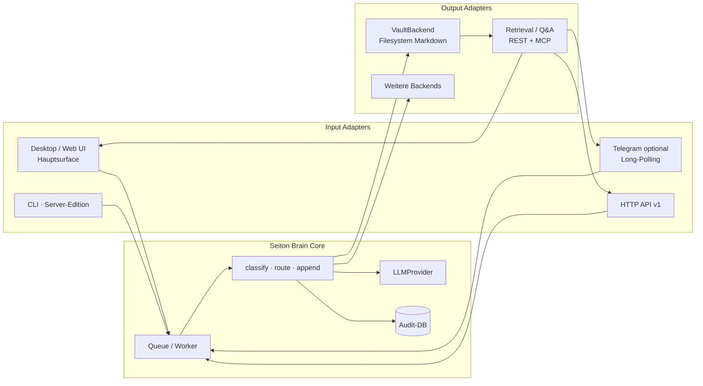

# Architecture

Stand: 0.2.0+ (Phase C begonnen: Health, Logging, REST-API v1 `/v1/*`).
Diagramme als Mermaid. Für Roadmap siehe [`ROADMAP.md`](./ROADMAP.md), für Setup [`docs/setup.md`](./docs/setup.md).

---

## High-Level


---

## Services (Docker Compose)

| Service | Image | Rolle | Ports |
|---------|-------|-------|-------|
| `api` | eigenes (Dockerfile) | FastAPI, Webhook-Endpoint, enqueued Tasks | `8000` |
| `worker` | eigenes (Dockerfile) | Celery: LLM, DB, Vault, Whisper | — |
| `db` | `postgres:16` | Datenbank | intern |
| `redis` | `redis:7-alpine` | Celery Broker + Result Backend | intern |

**Dockerfile:** Multi-Stage-Build (venv in Builder-Stage), Container läuft als User `seiton` (UID/GID 1000), `HEALTHCHECK` gegen `GET /health` (nur `api`; `worker` deaktiviert den Check in Compose).

Volumes:
- `postgres-data` (Named Volume) — DB-Persistenz
- `${OBSIDIAN_VAULT_HOST_PATH} → /vault` (Bind Mount) — der echte Obsidian-Vault auf dem Host

**Backups:** `scripts/backup.sh` — lokaler Postgres-Dump + Vault-`tar.gz` nach `backups/` (siehe `docs/setup.md`).

**Consumer-Install (E20-1):** `scripts/install.sh` / `install.ps1` + `docker-compose.consumer.yml` — siehe `docs/packaging.md`.

**VPS-Deploy (E20-2):** `scripts/deploy-vps.sh` + `docker-compose.vps.yml` — siehe `docs/vps-deployment.md`.

**Auto-Update (E20-4):** `scripts/update.sh` — siehe `docs/packaging.md`.

---

## Modul-Map (`app/`)

```
app/
├── main.py                  FastAPI-App, /health, registriert Webhook-Router
├── config.py                Settings-Klasse (pydantic-settings), zentrale Env-Konfig
├── telegram/
│   ├── webhook.py           POST /webhook (Transport) + process_update (transport-agnostisch)
│   ├── polling.py           Long-Polling-Poller (getUpdates) als Webhook-Alternative (E1-5)
│   ├── client.py            sendMessage, downloadFile, getUpdates, deleteWebhook
│   └── admin_notify.py      Admin-DM bei dauerhaften Worker-Fehlern (E10-3)
├── worker/
│   ├── celery_app.py        Celery-Config
│   └── tasks.py             process_text/voice/ask/digest tasks (E17-4/8)
├── services/
│   ├── process_message.py   Orchestrierung Capture: LLM → DB → Vault
│   └── answer.py            RAG-Antwort-Service: Retrieval → LLM → AnswerResult (E17-3)
├── llm/
│   ├── provider.py          LLMProvider (ABC: classify, answer) + get_llm_provider()
│   ├── openai_provider.py   OpenAI-Implementierung (Chat-Completions, JSON-Mode)
│   ├── embeddings.py        EmbeddingProvider (ABC) + OpenAI + get_embedding_provider() (E17-2)
│   ├── parser.py            JSON→Pydantic (classify + answer), Retry-Konstanten
│   └── schemas.py           ClassificationResult, AnswerResult/NoteRef/LLMAnswer (Pydantic)
├── vault/
│   ├── reader.py            VaultNote-Parsing, format_notes_for_prompt
│   ├── extractors.py        DocumentExtractor (ABC) + md/txt/pdf/docx/pptx-Adapter (E18-1/2/3)
│   ├── index.py             Vault-Index + Keyword-/semantische Suche + retrieve_vault_notes (E17-1/2/5)
│   └── writer.py            write_note, CATEGORY_FOLDERS
├── transcription/
│   └── whisper.py           OpenAI Whisper API
├── webhooks/
│   └── outbound.py          Outbound Events (note.created, note.indexed, …)
├── models/
│   ├── base.py              SQLAlchemy DeclarativeBase
│   └── entry.py             Entry-ORM
└── db/
    └── session.py           get_db (API), worker_session (Celery)
```

Externe Artefakte:
- `prompts/classify.txt` — versionierter LLM-Prompt (Capture/Klassifikation)
- `prompts/answer.txt` — versionierter RAG-Prompt (E17-3)
- `alembic/versions/*.py` — DB-Migrationen
- `vault.example/` — Vault-Template für neue Selfhoster
- `/vault/` (Bind Mount, gitignored) — der echte persönliche Vault
- `docs/integrations/` — Vision: n8n, REST-API, Setup-CLI, Vault-Backends
- `docs/adr/` — Architecture Decision Records

---

## Datenfluss: Text-Nachricht

1. Telegram POSTed Update an `/webhook` mit Header `X-Telegram-Bot-Api-Secret-Token`
2. `webhook.py` validiert Secret → Allowlist-Check → **Idempotenz-Check**: indexed Lookup auf `entries.telegram_update_id`; bei Duplikat sofort `200 OK` ohne Bot-Reply (Telegram-Retry-Schutz)
3. Sonst: enqueued `process_text_message_task(text, chat_id, update_id, message_id)` → antwortet `200 OK` + sendet „Wird verarbeitet…" zurück

> **Webhook vs. Long-Polling (E1-5):** Schritte 2–3 stecken in `process_update(update)` und sind transport-agnostisch. Der Webhook (`/webhook`) ruft es nach Secret-/Body-Check auf; alternativ pollt `app.telegram.polling` Telegram per `getUpdates` (kein öffentlicher URL-Zwang) und ruft pro Update dasselbe `process_update`. Beides schließt sich gegenseitig aus — der Poller ruft beim Start `deleteWebhook`. Ab Schritt 4 ist der Fluss identisch.
4. Celery-Worker greift Task ab → öffnet **neue** Async-Engine (`worker_session()`) → übergibt an `services.process_message.process_text_message`
5. Service:
   - Pre-Check `telegram_update_id` (Race-Schutz)
   - `LLMProvider.classify(text)` — Prompt enthält Vault-Kontext + entscheidet `action: create | append`
   - **Branch Create:** `write_note(result)` legt neue `.md` an (Kollisionsschutz aus E3-1)
   - **Branch Append:** `_resolve_append_target()` sucht den juengsten Entry mit gleichem `title` in der DB; gibt es ihn und liegt die Datei noch im Vault, ruft `append_to_note(vault_path, result)` einen `## Update YYYY-MM-DD`-Block ein. Sonst transparenter Fallback auf Create (mit Warn-Log)
   - `Entry` persistieren (Audit, Telegram-Metadaten, `raw_input`, `kind`, `status` = `processed`/`appended`); `IntegrityError` → `None` zurück (last-resort Race-Fallback)
6. Worker sendet Bestätigung zurück — bei Create `„Gespeichert als [[Title]] unter Folder"`, bei Append `„Ergänzt: [[Target-Title]]"`. Duplikat → keine Bestätigung.

## Datenfluss: Voice-Nachricht

1. Telegram POSTed Update mit `message.voice.file_id`
2. `webhook.py` enqueued `process_voice_message_task(file_id, chat_id)` → `200 OK` + „Sprachnachricht wird verarbeitet…"
3. Worker:
   - `download_file(file_id)` → OGG-Bytes
   - `transcribe_audio(bytes)` → Text via Whisper-API
   - ab hier identisch zur Text-Pipeline

---

## Conventions

Diese Regeln gelten projektweit. Bei Verstößen → ADR schreiben statt heimlich brechen.

### Code & Architektur
- **Prompts in Git, Secrets in `.env`** — niemals API-Keys oder Bot-Tokens committen
- **Konfiguration ausschließlich über `app/config.py`** — App-Module lesen *nicht* direkt aus `os.environ`. Neue Env-Variable? → Feld in `Settings` ergänzen, `.env.example` aktualisieren. Einzige Ausnahme: `alembic/env.py` (eigenständiger Bootstrap außerhalb des App-Lifecycles)
- **Vault ist Source of Truth** — die Postgres-Datenbank ist Audit/Cache, kein Ersatz für die Markdown-Dateien
- **Celery + Async DB** — immer `worker_session()` verwenden, nie die globale `engine` aus `app/db/session.py` (siehe [ADR 0001](./docs/adr/0001-async-engine-per-celery-task.md))
- **LLM-Output strikt validieren** — alle LLM-Antworten gehen durch Pydantic (`ClassificationResult`), keine `dict[str, Any]`-Durchreichen
- **Existing-Notes sanitizieren** — LLM darf nur reale Titel als `related` zurückgeben (`_sanitize_related`)
- **Migrationen lokal in Git** — `alembic revision --autogenerate` lokal laufen lassen, nicht nur im Container

### Tests
- Tests laufen **offline** — keine echten API-Calls, keine echte DB-Verbindung
- Env in `tests/conftest.py` setzen, bevor App-Imports geladen werden
- `pytest` + `ruff check app tests` müssen grün sein vor Merge

### Git / Repo
- `.gitignore`: **`/vault/`** und **`/models/`** (mit führendem Slash) — sonst werden `app/vault/` und `app/models/` mit-ignoriert (siehe [ADR 0002](./docs/adr/0002-gitignore-vault-and-models-pitfall.md))
- README ist DE+EN, deutsch zuerst
- Commits klein und fokussiert; eine Story → eine PR

### Sprache
- Code, Tests, Doku-Identifier in Englisch
- Benutzer-sichtbare Strings (Telegram-Antworten) in Deutsch
- Roadmap, ADRs, Setup-Doku in Deutsch (Projekt ist persönlich)
- README bleibt zweisprachig

---

## Was die DB speichert

```
entries
├── id                   PK
├── title                VARCHAR(255)
├── category             VARCHAR(50)
├── summary              TEXT
├── raw_input            TEXT                                 NULL
├── vault_path           VARCHAR(500)                         NULL
├── telegram_chat_id     BIGINT          INDEX                NULL
├── telegram_message_id  BIGINT                               NULL
├── telegram_update_id   BIGINT          UNIQUE               NULL
├── kind                 VARCHAR(10)     DEFAULT 'text'       NOT NULL
├── status               VARCHAR(20)     DEFAULT 'processed'  NOT NULL
└── created_at           TIMESTAMPTZ     DEFAULT now()        NOT NULL
```

Erlaubte Werte (im Code als Sets dokumentiert, siehe `app/models/entry.py`):

| Feld | Werte |
|------|-------|
| `kind` | `text`, `voice` |
| `status` | `processed`, `failed`, `rejected` |

Service-Layer befüllt die `telegram_*`-Felder, `raw_input`, `vault_path` und
nicht-Default-Werte für `kind`/`status` noch nicht — das übernehmen die
Folgestories E1-2 (Idempotenz) und E3-1 (Filename-Kollision/vault_path).

---

## Was die `.md`-Datei enthält

```markdown
---
title: <title>
category: <category>
created: YYYY-MM-DD
tags: [<tag>, <tag>]   ← nur wenn tags-Liste nicht leer (E4-2)
---

# <title>

<summary>

## Related      ← nur wenn related-Liste nicht leer
- [[<related title>]]
- [[<related title>]]
```

Speicherort: `<VAULT>/<Category-Folder>/<sanitized-title>.md`. Bei
Titelkollision wird der naechste freie Slot im Obsidian-Stil verwendet:
`<sanitized-title> (2).md`, `<sanitized-title> (3).md`, ... Der finale
relative Pfad (z.B. `Ideas/Fitness App (2).md`) landet in
`entries.vault_path`.

### Append-Format (E3-2)

Bei `action="append"` haengt der Writer einen Update-Block an die bestehende
Datei an statt eine neue anzulegen:

```markdown
## Update 2026-06-04

<summary>

## Related      ← nur wenn related-Liste nicht leer
- [[<related title>]]
```

Frontmatter wird in E3-2 noch **nicht** mit-aktualisiert (`updated:`-Datum,
Tag-Merge) — das ist Story E3-3.

Mapping Category → Folder in `app/vault/writer.py:CATEGORY_FOLDERS`:

| Category | Folder |
|----------|--------|
| school   | School |
| work     | Work |
| private  | Private |
| idea     | Ideas |
| travel   | Travel |
| note     | Notes (Default) |

---

## Langfristige Architektur: Engine + Adapter

> **Status:** Vision. Entscheidungen in
> [ADR 0003](./docs/adr/0003-engine-and-adapters.md) (Engine + Adapter) und
> [ADR 0004](./docs/adr/0004-commercial-consumer-product.md) (kommerzielles
> Produkt). Heute implementiert: Telegram-Input + Filesystem-Vault.

Der Kern ist eine **headless Engine**; Eingänge und Ausgänge sind Adapter. Mit
dem Produkt-Pivot (ADR 0004) wird die **UI zum Hauptadapter**, Telegram zum
optionalen Eingang (Long-Polling), und der n8n-Eigenbau entfällt.



| Adapter | Heute | Geplant (Epic) |
|---------|-------|----------------|
| UI / Dashboard (Hauptsurface) | `/dashboard` 🟢, `/ask` 🟢, `/notes` 🟢, `/settings` 🟢, `/setup` 🟢 | E19 komplett |
| Telegram (optional, Long-Polling) | ✅ Webhook + Long-Polling (E1-5) | — |
| HTTP REST | ✅ | E13 REST API |
| Setup | — | E19-1 UI-Wizard (CLI/`doctor` für Server-Edition, E16) |
| Filesystem Vault | ✅ | E15 `VaultBackend`-Interface |
| Retrieval / Q&A | teilw. (E17-1) | E17 (Keyword → semantisch → RAG) |
| MCP-Server (Brain als Tool für LLM-Agents) | ✅ `examples/mcp/` | — |
| ~~n8n~~ | — | ❌ gestrichen (ADR 0004); via REST durch Power-User möglich |

Integrations-Details: [`docs/integrations/`](./docs/integrations/).
Roadmap-Stories: Phasen E–G, Epics E13–E21 in [`ROADMAP.md`](./ROADMAP.md).

**Bewusst nicht:** Remote-Setup mit Key-Upload; eigene Obsidian-Ersatz-App
(Editor/Graph/Plugins); ungeschützte Public-Retrieval-Endpunkte (Auth identisch
zur Capture-API); eigene n8n-Node bauen/pflegen.

### Produkt-Editionen (ADR 0004)

Mit dem kommerziellen Pivot zeichnet sich eine mögliche Zweiteilung ab — bewusst
zu entscheiden, noch offen:

- **Consumer-Edition:** UI-first, lokales Self-Hosting (Mac/Win/Linux), Telegram
  per Long-Polling, ggf. vereinfachter Stack (SQLite/in-process Worker, E9-5),
  reduzierte Version → später Desktop-App (E20).
- **Server/VPS-Edition:** voller Stack (Postgres/Redis/Celery), Webhook möglich,
  Dauerbetrieb auf VPS (z. B. IONOS), CLI-Setup.

### Capture und Retrieve als gleichwertige Hälften

Die Engine hat zwei Daseinszwecke: **Capture** (heute implementiert) und
**Retrieve** (Epic E17, Phase F geplant). Beide Hälften nutzen denselben
Engine-Kern, dieselben Pydantic-Schemas und denselben `VaultBackend`. Ohne
Retrieve bleibt das System ein gut sortiertes Archiv; mit Retrieve wird es
zur Wissensquelle, auf die Telegram (`/ask`), REST-Konsumenten und externe
LLM-Agenten via MCP zugreifen können.
