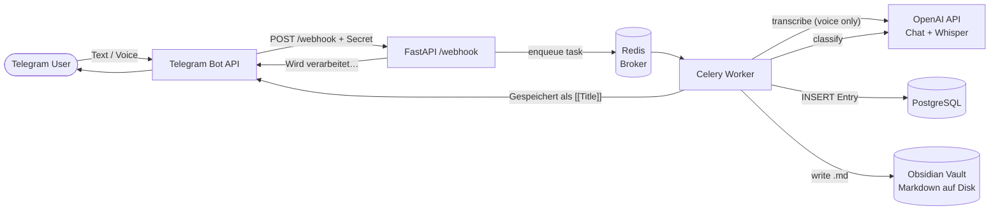

# Architecture

Stand: 0.1.0 (Initial pipeline, Epic 1–7).
Diagramme als Mermaid. Für Roadmap siehe [`ROADMAP.md`](./ROADMAP.md), für Setup [`docs/setup.md`](./docs/setup.md).

---

## High-Level



---

## Services (Docker Compose)

| Service | Image | Rolle | Ports |
|---------|-------|-------|-------|
| `api` | eigenes (Dockerfile) | FastAPI, Webhook-Endpoint, enqueued Tasks | `8000` |
| `worker` | eigenes (Dockerfile) | Celery: LLM, DB, Vault, Whisper | — |
| `db` | `postgres:16` | Datenbank | intern |
| `redis` | `redis:7-alpine` | Celery Broker + Result Backend | intern |

Volumes:
- `postgres-data` (Named Volume) — DB-Persistenz
- `${OBSIDIAN_VAULT_HOST_PATH} → /vault` (Bind Mount) — der echte Obsidian-Vault auf dem Host

---

## Modul-Map (`app/`)

```
app/
├── main.py                  FastAPI-App, /health, registriert Webhook-Router
├── telegram/
│   ├── webhook.py           POST /webhook, Secret-Check, enqueue
│   └── client.py            sendMessage, downloadFile
├── worker/
│   ├── celery_app.py        Celery-Config
│   └── tasks.py             process_text_message_task, process_voice_message_task
├── services/
│   └── process_message.py   Orchestrierung: LLM → DB → Vault
├── llm/
│   ├── provider.py          LLMProvider (ABC) + get_llm_provider()
│   ├── openai_provider.py   OpenAI-Implementierung (Chat-Completions, JSON-Mode)
│   └── schemas.py           ClassificationResult (Pydantic)
├── vault/
│   ├── reader.py            list_existing_notes, format_notes_for_prompt
│   └── writer.py            write_note, CATEGORY_FOLDERS
├── transcription/
│   └── whisper.py           OpenAI Whisper API
├── models/
│   ├── base.py              SQLAlchemy DeclarativeBase
│   └── entry.py             Entry-ORM
└── db/
    └── session.py           get_db (API), worker_session (Celery)
```

Externe Artefakte:
- `prompts/classify.txt` — versionierter LLM-Prompt
- `alembic/versions/*.py` — DB-Migrationen
- `vault.example/` — Vault-Template für neue Selfhoster
- `/vault/` (Bind Mount, gitignored) — der echte persönliche Vault

---

## Datenfluss: Text-Nachricht

1. Telegram POSTed Update an `/webhook` mit Header `X-Telegram-Bot-Api-Secret-Token`
2. `webhook.py` validiert Secret → enqueued `process_text_message_task(text, chat_id)` → antwortet `200 OK` + sendet „Wird verarbeitet…" zurück
3. Celery-Worker greift Task ab → öffnet **neue** Async-Engine (`worker_session()`) → übergibt an `services.process_message.process_text_message`
4. Service:
   - `LLMProvider.classify(text)` — Prompt enthält Vault-Kontext (existierende Notizen)
   - `Entry` in DB persistieren (Audit-Trail)
   - `write_note(result)` — Markdown-Datei im Vault anlegen
5. Worker sendet Bestätigung „Gespeichert als [[Title]] unter Folder" zurück

## Datenfluss: Voice-Nachricht

1. Telegram POSTed Update mit `message.voice.file_id`
2. `webhook.py` enqueued `process_voice_message_task(file_id, chat_id)` → `200 OK` + „Sprachnachricht wird verarbeitet…"
3. Worker:
   - `download_file(file_id)` → OGG-Bytes
   - `transcribe_audio(bytes)` → Text via Whisper-API
   - ab hier identisch zur Text-Pipeline

---

## Conventions

Diese Regeln gelten projektweit. Bei Verstößen → ADR schreiben statt heimlich brechen.

### Code & Architektur
- **Prompts in Git, Secrets in `.env`** — niemals API-Keys oder Bot-Tokens committen
- **Vault ist Source of Truth** — die Postgres-Datenbank ist Audit/Cache, kein Ersatz für die Markdown-Dateien
- **Celery + Async DB** — immer `worker_session()` verwenden, nie die globale `engine` aus `app/db/session.py` (siehe [ADR 0001](./docs/adr/0001-async-engine-per-celery-task.md))
- **LLM-Output strikt validieren** — alle LLM-Antworten gehen durch Pydantic (`ClassificationResult`), keine `dict[str, Any]`-Durchreichen
- **Existing-Notes sanitizieren** — LLM darf nur reale Titel als `related` zurückgeben (`_sanitize_related`)
- **Migrationen lokal in Git** — `alembic revision --autogenerate` lokal laufen lassen, nicht nur im Container

### Tests
- Tests laufen **offline** — keine echten API-Calls, keine echte DB-Verbindung
- Env in `tests/conftest.py` setzen, bevor App-Imports geladen werden
- `pytest` + `ruff check app tests` müssen grün sein vor Merge

### Git / Repo
- `.gitignore`: **`/vault/`** und **`/models/`** (mit führendem Slash) — sonst werden `app/vault/` und `app/models/` mit-ignoriert (siehe [ADR 0002](./docs/adr/0002-gitignore-vault-and-models-pitfall.md))
- README ist DE+EN, deutsch zuerst
- Commits klein und fokussiert; eine Story → eine PR

### Sprache
- Code, Tests, Doku-Identifier in Englisch
- Benutzer-sichtbare Strings (Telegram-Antworten) in Deutsch
- Roadmap, ADRs, Setup-Doku in Deutsch (Projekt ist persönlich)
- README bleibt zweisprachig

---

## Was die DB speichert (Stand 0.1.0)

```
entries
├── id (PK)
├── title       VARCHAR(255)
├── category    VARCHAR(50)
├── summary     TEXT
└── created_at  TIMESTAMPTZ DEFAULT now()
```

→ E2-1 erweitert um `telegram_chat_id`, `telegram_message_id`, `telegram_update_id (unique)`, `raw_input`, `vault_path`, `status`, `kind`.

---

## Was die `.md`-Datei enthält

```markdown
---
title: <title>
category: <category>
created: YYYY-MM-DD
---

# <title>

<summary>

## Related      ← nur wenn related-Liste nicht leer
- [[<related title>]]
- [[<related title>]]
```

Speicherort: `<VAULT>/<Category-Folder>/<sanitized-title>.md`

Mapping Category → Folder in `app/vault/writer.py:CATEGORY_FOLDERS`:

| Category | Folder |
|----------|--------|
| school   | School |
| work     | Work |
| private  | Private |
| idea     | Ideas |
| travel   | Travel |
| note     | Notes (Default) |
