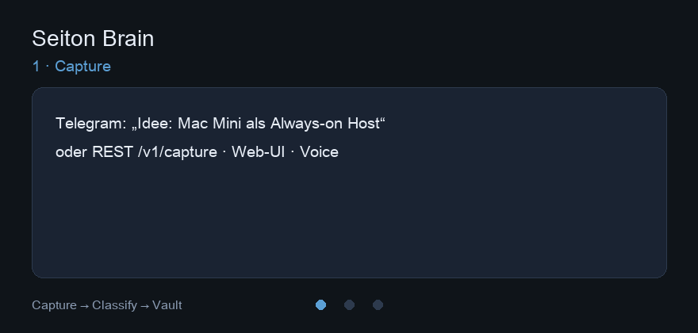
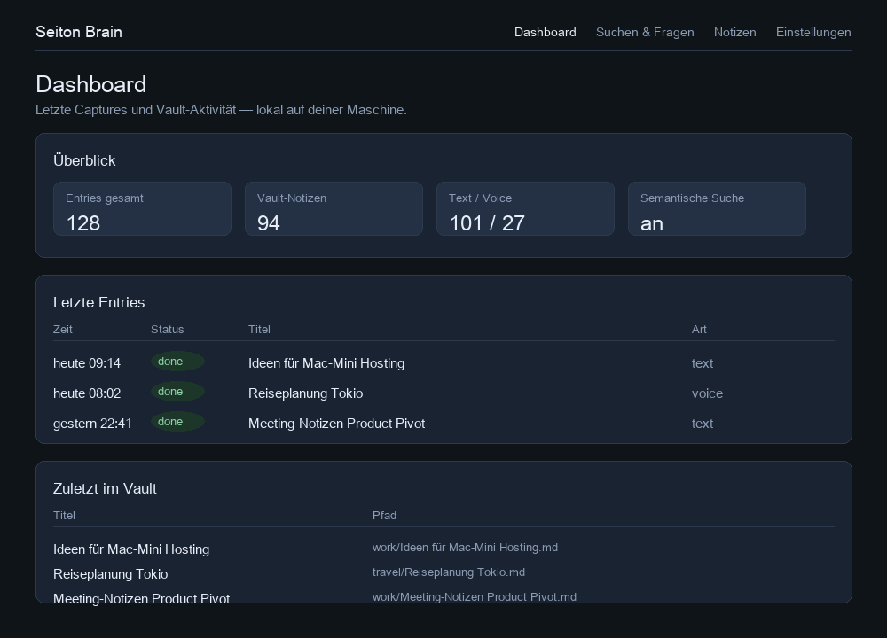
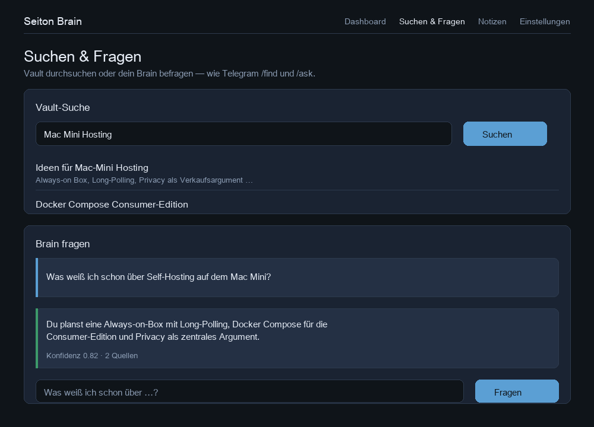

# Seiton Brain

> **Status:** Öffentliche Entwicklung / Portfolio-Projekt (MIT). Geplante
> **kommerzielle Consumer-Edition** (self-hosted, buy-once, BYO-Key) — siehe
> [ADR 0004](docs/adr/0004-commercial-consumer-product.md) und
> [ADR 0005](docs/adr/0005-repo-and-license-strategy.md).

Ziel:

Ich schreibe dem Bot eine Nachricht — eine halbe Idee, ein Gedanke unterwegs, irgendwas das sonst in einer Notiz-App vergessen würde. Das LLM sortiert es ein, legt eine Markdown-Datei in meinem Obsidian-Vault ab und schickt mir eine kurze Bestätigung zurück. Fertig.

Der Name kommt von **Seiton** (整頓) — alles an seinen Platz legen, damit man es wiederfindet. Genau das soll das Projekt für meine Gedanken machen.

  

  
  &nbsp;
  

---

## Warum das existiert

Ich verliere ständig Ideen, weil ich sie irgendwo hinmurmle und nie wieder draufschaue. Obsidian nutze ich schon — aber der Schritt von „roher Input" zu „ordentliche Notiz" ist mir zu oft zu viel Aufwand.

Seiton Brain soll diesen Schritt wegnehmen. Gleichzeitig ist es ein **Showcase-Projekt** für Backend-, AI- und Systemdesign — mit echtem Nutzen im Alltag und einer klaren Produktvision (Web-UI, Self-Hosting, Lizenzierung).

---

## Was schon läuft

Stand jetzt (v0.2.x, Phase C–F):

- Telegram-Bot: Text **und** Sprachnachrichten (Webhook oder Long-Polling)
- Sofortige Antwort, Verarbeitung async via Celery + Redis (Retries bei transienten OpenAI-Fehlern)
- OpenAI klassifiziert (Kategorie, Titel, Summary, Tags) — Prompt in `/prompts`; optional **Ollama** lokal (`LLM_PROVIDER=ollama`, [`docs/llm-providers.md`](./docs/llm-providers.md))
- **Append vs. Create**, strukturierte Tags, Slash-Commands (`/recent`, `/find`, `/undo`, `/ask`, `/digest`)
- **Knowledge Retrieval:** Keyword- + semantische Suche (pgvector), RAG `/ask`, Digest-Synthese
- REST-API v1 (`/v1/capture`, `/v1/ask`, `/v1/digest`, …) + Outbound-Webhooks
- MCP-Server für Cursor/Claude (`examples/mcp/`)
- Web-UI (E19): Setup-Wizard, Dashboard, Suche/Ask, Notizen, Settings
- Consumer-Installer für Heim-Box (E20-1): `./scripts/install.sh`
- Offline-Lizenz Ed25519 (E21-1), Self-Hosting-Hub
- PostgreSQL + Alembic, Obsidian-Vault mit `[[links]]`, Docker Compose, pytest + GitHub CI (360 Tests)

Vollständige Historie: [`CHANGELOG.md`](./CHANGELOG.md).
Was als nächstes kommt: [`ROADMAP.md`](./ROADMAP.md).
Integrations (REST, MCP, n8n-Beispiele): [`docs/integrations/`](./docs/integrations/).
Wie es gebaut ist: [`ARCHITECTURE.md`](./ARCHITECTURE.md).
Wie selbst betreiben: [`docs/self-hosting.md`](./docs/self-hosting.md) · Entwickler: [`docs/setup.md`](./docs/setup.md) · Troubleshooting: [`docs/troubleshooting.md`](./docs/troubleshooting.md) · Mitwirken: [`CONTRIBUTING.md`](./CONTRIBUTING.md) · Sicherheit: [`SECURITY.md`](./SECURITY.md)

---

## Was ich damit lernen wollte

Das Projekt ist absichtlich so aufgebaut, dass ich Backend- und AI-Themen nicht nur lese, sondern anfasse:

- **API-Design** — FastAPI, Routen, Request-Handling
- **Webhooks** — externe Services (Telegram) anbinden, absichern, schnell antworten
- **Datenbank** — Postgres, async SQLAlchemy, Migrationen mit Alembic
- **LLM-Anbindung** — strukturierter Output, Prompts versionieren, Provider austauschbar halten
- **Automatisierung** — Input rein, Verarbeitung, Output raus, ohne manuell was anklicken zu müssen
- **Infrastruktur** — Docker Compose, Services sauber starten, Volumes, Env-Variablen

Ich wollte ein System bauen, das sich wie ein kleines echtes Backend anfühlt — nicht wie fünf lose Skripte.

---

## Was noch fehlt (Produkt)

- Verkaufskanal / Lizenz-Ausgabe (E21-2)
- Multi-Format-Ingestion vertiefen (OCR/Vision — Epic E18)
- Optionale Consumer-Stack-Vereinfachung (SQLite / in-process Worker — E9-5)

---

## Hinweis

**Obsidian ist optional** — jeder Markdown-Ordner reicht. Details:
[`docs/vault.md`](./docs/vault.md).

`vault.example/` ist nur eine Vorlage für die Ordnerstruktur. Mein echter Vault liegt lokal und ist nicht im Repo.

Setup-Details: [`docs/setup.md`](./docs/setup.md) · Schnellstart Heim-Box: [`docs/packaging.md`](./docs/packaging.md).

---

## Lizenz

Aktuell [MIT](./LICENSE) — öffentliche Entwicklung und Portfolio-Nutzung.
Eine spätere **kommerzielle Edition** wird separat lizenziert; siehe
[ADR 0005](docs/adr/0005-repo-and-license-strategy.md).

---

# English

> **Status:** Public development / portfolio project (MIT). A future **commercial
> consumer edition** (self-hosted, buy-once, BYO-key) is planned — see
> [ADR 0004](docs/adr/0004-commercial-consumer-product.md) and
> [ADR 0005](docs/adr/0005-repo-and-license-strategy.md).

Goal:

I send the bot a message — half an idea, a thought on the go, something that would otherwise get lost in a notes app. The LLM sorts it, writes a Markdown file into my Obsidian vault, and sends me a short confirmation. Done.

The name comes from **Seiton** (整頓) — putting everything in its place so you can actually find it again. That's what this project is supposed to do for my thoughts.

  

  
  &nbsp;
  

---

## Why this exists

I keep losing ideas because I mumble them somewhere and never look at them again. I already use Obsidian — but going from raw input to a proper note is often too much effort for me.

Seiton Brain is meant to remove that step. It's also a **showcase project** for backend, AI, and system design — with real daily utility and a clear product vision (web UI, self-hosting, licensing).

---

## What works already

v0.2.x (phases C–F):

- Telegram bot: text **and** voice (webhook or long-polling)
- Immediate reply, async processing via Celery + Redis (retries on transient OpenAI errors)
- OpenAI classification (category, title, summary, tags) — prompt in `/prompts`; optional local **Ollama** (`LLM_PROVIDER=ollama`, [`docs/llm-providers.md`](./docs/llm-providers.md))
- **Append vs. create**, structured tags, slash commands (`/recent`, `/find`, `/undo`, `/ask`, `/digest`)
- **Knowledge retrieval:** keyword + semantic search (pgvector), RAG `/ask`, digest synthesis
- REST API v1 + outbound webhooks; MCP server for Cursor/Claude (`examples/mcp/`)
- Web UI (E19): setup wizard, dashboard, search/ask, notes, settings
- Consumer installer for home box (E20-1): `./scripts/install.sh`
- Offline Ed25519 license (E21-1), self-hosting hub
- PostgreSQL + Alembic, Obsidian vault with `[[links]]`, Docker Compose, pytest + GitHub CI (360 tests)

Full history: [`CHANGELOG.md`](./CHANGELOG.md).
What's next: [`ROADMAP.md`](./ROADMAP.md).
Integrations: [`docs/integrations/`](./docs/integrations/).
How it's built: [`ARCHITECTURE.md`](./ARCHITECTURE.md).
How to self-host: [`docs/self-hosting.md`](./docs/self-hosting.md) · Developers: [`docs/setup.md`](./docs/setup.md) · Contributing: [`CONTRIBUTING.md`](./CONTRIBUTING.md) · Security: [`SECURITY.md`](./SECURITY.md)

---

## What I wanted to learn

The project is deliberately set up so I don't just read about backend and AI topics — I actually touch them:

- **API design** — FastAPI, routes, request handling
- **Webhooks** — connecting external services (Telegram), securing them, responding fast
- **Database** — Postgres, async SQLAlchemy, migrations with Alembic
- **LLM integration** — structured output, versioning prompts, keeping providers swappable
- **Automation** — input in, processing, output out, without manually clicking through things
- **Infrastructure** — Docker Compose, starting services cleanly, volumes, env variables

I wanted to build something that feels like a small real backend — not five loose scripts.

---

## What's still missing (product)

- Sales channel / license issuance (E21-2)
- Deeper multi-format ingestion (OCR/Vision — epic E18)
- Optional consumer stack simplification (SQLite / in-process worker — E9-5)

---

## Note

**Obsidian is optional.** Any markdown folder works. See [`docs/vault.md`](./docs/vault.md).

`vault.example/` is just a template for the folder structure. My actual vault lives locally and is not in the repo.

Setup details: [`docs/setup.md`](./docs/setup.md) · Home box quick start: [`docs/packaging.md`](./docs/packaging.md).

---

## License

Currently [MIT](./LICENSE) — public development and portfolio use.
A future **commercial edition** will be licensed separately; see
[ADR 0005](docs/adr/0005-repo-and-license-strategy.md).
