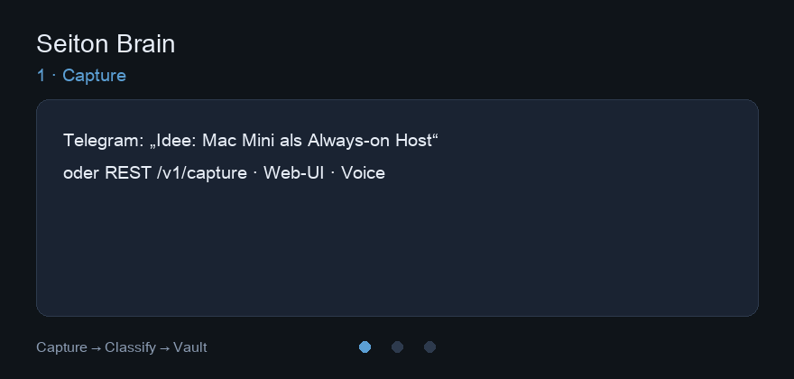
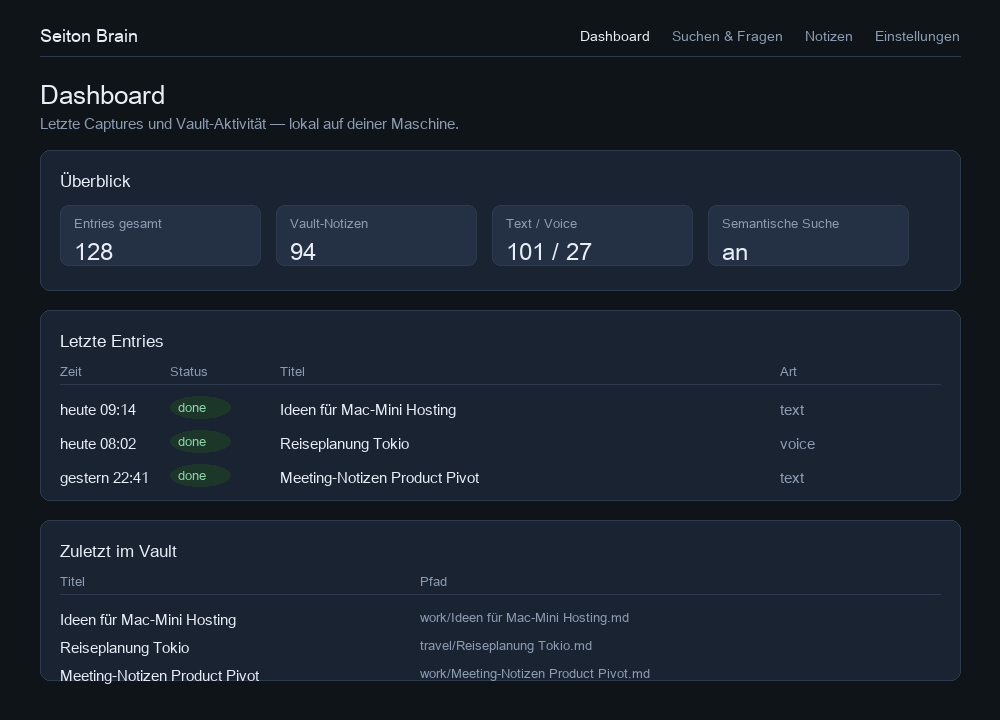
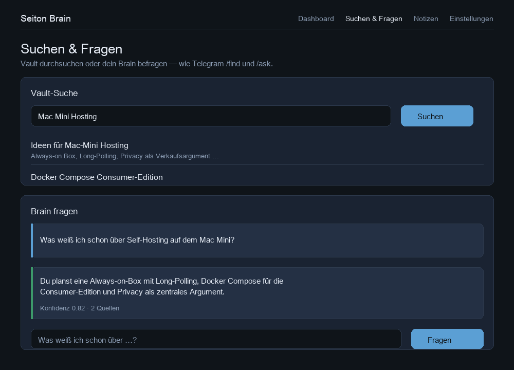

# Seiton Brain

**Personal AI second brain** — capture thoughts, voice, and files; classify and
store them in an Obsidian-compatible Markdown vault; retrieve answers with search
and RAG.

<p align="center">
  
</p>

<p align="center">
  
  &nbsp;
  
</p>

---

## Status

| | |
|---|---|
| **Version** | v0.3.0 on `main` (pre-release / launch hardening) |
| **License** | [MIT](LICENSE) for this repository |
| **Deployment today** | **Self-hosted** (Docker Compose, home server, VPS) — you run the stack |
| **Deployment later** | **Managed Seiton Cloud** is part of the product vision, not available yet ([ADR 0008](docs/adr/0008-deployment-models-self-hosted-first.md)) |
| **Commercial edition** | Planned (buy-once self-hosted, BYO LLM key) — [ADR 0004](docs/adr/0004-commercial-consumer-product.md) |

Self-hosting is the **first shipped deployment model** and a strong privacy/control
option — it is **not** the product identity.

---

## What it does

- **Capture** — Telegram (text/voice), web UI, REST API, MCP
- **Understand & organize** — LLM classification into your vault structure
- **Remember** — Markdown notes, Postgres index, pgvector embeddings
- **Retrieve** — keyword + semantic search, RAG `/ask`, digest, citations
- **Integrate** — REST v1, webhooks, MCP examples, n8n workflow JSONs

Stack: FastAPI · PostgreSQL + pgvector · Celery + Redis · Docker Compose ·
optional Ollama / OpenAI · local web UI + PWA.

---

## Quick start

**Self-hosted (recommended path):**

```bash
git clone https://github.com/LeekiGitHub/Seiton-Brain.git
cd Seiton-Brain
./scripts/install.sh    # consumer / home box — see docs/packaging.md
```

Other paths: [Self-hosting overview](docs/self-hosting.md) ·
[Developer setup](docs/setup.md) · [VPS deployment](docs/vps-deployment.md)

After install: open the setup wizard in your browser, configure `.env`, start
capturing.

**Obsidian** is optional — any Markdown folder works ([vault docs](docs/vault.md)).

---

## Privacy & security

- Data stays on **your** hardware in the self-hosted edition (vault, DB, secrets)
- No Seiton-operated cloud service or telemetry today
- BYO API keys for LLM providers; optional local models (Ollama)
- Report vulnerabilities **privately** — see [SECURITY.md](SECURITY.md)

---

## Documentation

| Topic | Link |
|-------|------|
| Current state & next work | [docs/current-state.md](docs/current-state.md) |
| Roadmap | [ROADMAP.md](ROADMAP.md) |
| Architecture | [ARCHITECTURE.md](ARCHITECTURE.md) |
| Self-hosting | [docs/self-hosting.md](docs/self-hosting.md) |
| Integrations (REST, MCP, n8n) | [docs/integrations/](docs/integrations/) |
| Licensing (commercial plan) | [docs/licensing.md](docs/licensing.md) |
| Changelog | [CHANGELOG.md](CHANGELOG.md) |

Internal planning docs (German): ADRs in [docs/adr/](docs/adr/).

---

## Contributing

Maintained primarily by a **solo developer**. Small fixes, docs, and focused PRs
are welcome — please read [CONTRIBUTING.md](CONTRIBUTING.md) first. Larger
features should align with [ROADMAP.md](ROADMAP.md).

---

## License

This repository is released under the [MIT License](LICENSE).

A separate **commercial consumer edition** is planned; it will be distributed and
licensed independently. See [docs/licensing.md](docs/licensing.md) and
[ADR 0005](docs/adr/0005-repo-and-license-strategy.md).

---

*Seiton* (整頓) — putting things in their place so you can find them again.
